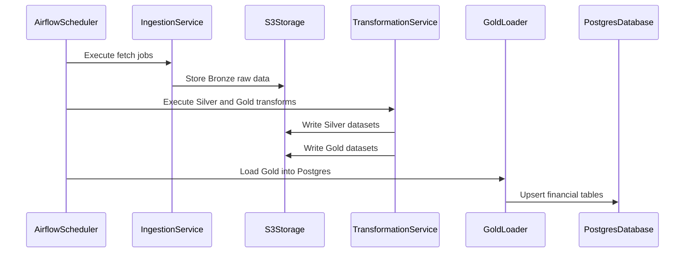
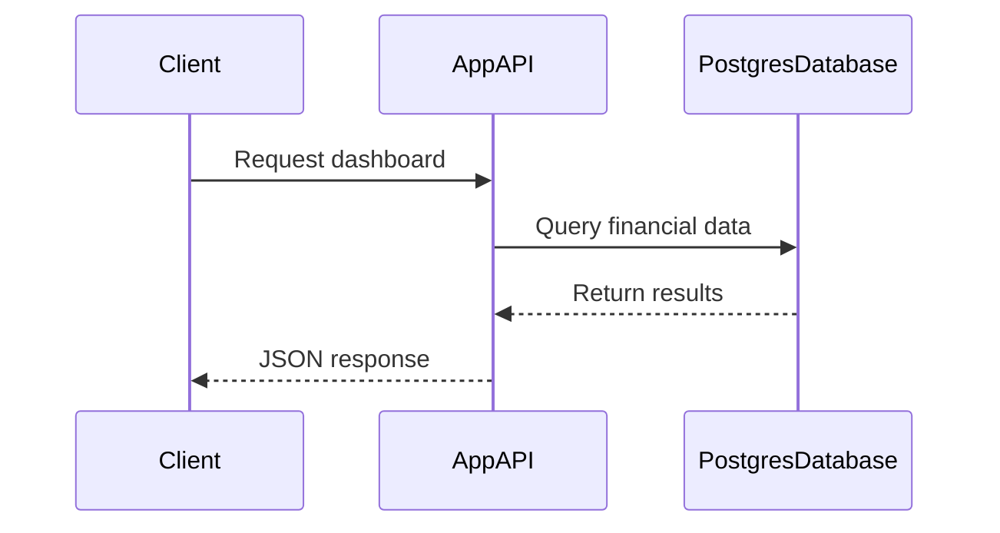

# Finance Data Platform

## Overview

This project implements a modern financial data infrastructure built around a clear separation between:

- Data Platform (batch processing layer)
- Application Service (serving layer)
- Client (frontend user interface)

The system is designed to be scalable, cost-efficient, and production-ready while remaining simple enough for iterative development.

The architecture follows a Bronze, Silver, Gold medallion model and uses AWS as the infrastructure backbone.

---

# System Architecture

## High-Level Architecture

```mermaid
flowchart TB

subgraph ExternalSources
    YF[Yahoo Finance]
    SEC[SEC EDGAR]
    FX[FX API]
    MAP[OpenFIGI]
end

subgraph DataPlatform
    AF[Airflow Scheduler]
    ING[Ingestion Service]
    TR[Transformation Service]
    LOAD[Gold Loader]
end

subgraph Storage
    S3[(AWS S3)]
    PG[(Postgres RDS)]
end

subgraph Application
    API[App Backend API]
end

subgraph Client
    UI[Frontend Client]
end

AF --> ING
ING --> S3
TR --> S3
LOAD --> PG

S3 --> TR
S3 --> LOAD

PG --> API
API --> UI

YF --> ING
SEC --> ING
FX --> ING
MAP --> ING
````

---

# Architecture Layers

## 1. Data Platform

The Data Platform is responsible for:

* Fetching financial data from external APIs
* Storing raw data (Bronze layer)
* Cleaning and normalizing datasets (Silver layer)
* Computing financial metrics (Gold layer)
* Loading Gold datasets into Postgres

This layer runs in batch mode and is orchestrated by Airflow.

It does not serve end users directly.

### Technologies Used

* Python
* Airflow
* AWS S3
* Pandas
* PyArrow
* Boto3
* SQLAlchemy
* Postgres

---

## 2. Application Service

The Application Service is responsible for:

* Authentication
* Portfolio management
* Watchlists
* Financial dashboards
* API endpoints for the client

The application only reads data from Postgres.

It never calls external financial APIs directly.

### Technologies Used

* FastAPI (or equivalent backend framework)
* SQLAlchemy
* Postgres (RDS)
* JWT authentication

---

## 3. Client

The Client is the user-facing interface.

It communicates exclusively with the Application API.

It never interacts with the Data Platform directly.

### Technologies Used

* Angular or React
* REST API integration
* Charting libraries

---

# Data Architecture

The platform follows a medallion architecture.

## Bronze Layer (Raw)

* Raw JSON payloads
* Stored in S3
* Append-only
* Partitioned by date

Example path:

```
s3://fin-platform-prod/bronze/source=yahoo/dataset=prices/dt=2026-02-17/AAPL.json
```

---

## Silver Layer (Cleaned)

* Normalized schemas
* Typed columns
* Harmonized identifiers
* Stored as Parquet in S3

---

## Gold Layer (Serving-Ready)

* Computed metrics
* Aggregated datasets
* Optimized for fast queries
* Stored as Parquet in S3
* Loaded into Postgres

---

# Daily Batch Process



---

# User Request Flow



---

# AWS Infrastructure

The infrastructure is intentionally minimal and cost-efficient.

| Component    | Purpose                                  |
| ------------ | ---------------------------------------- |
| S3           | Data lake storage (Bronze, Silver, Gold) |
| RDS Postgres | Serving database                         |
| EC2          | Airflow host                             |
| IAM          | Access control                           |

Estimated monthly cost: approximately 20–25 USD.

---

# Project Structure

```
services/
  data-platform/
    ingestion/
    transforms/
    marts/
    loaders/

  app-api/
    routes/
    services/
    db/

  frontend/

infra/
  airflow/
  terraform/
  docker/
```

---

# Design Principles

* Strict separation between data and application layers
* Batch processing over live external API calls
* Postgres as serving layer
* S3 as scalable data lake
* Cost control
* Reproducibility and auditability
* Production-ready architecture

---

# Conclusion

This project implements a structured financial data infrastructure with:

* A clean medallion data architecture
* A clear separation between Data Platform, Application, and Client
* A scalable AWS deployment
* A serving layer optimized for SaaS applications

The system is designed for reliability, extensibility, and long-term scalability.

