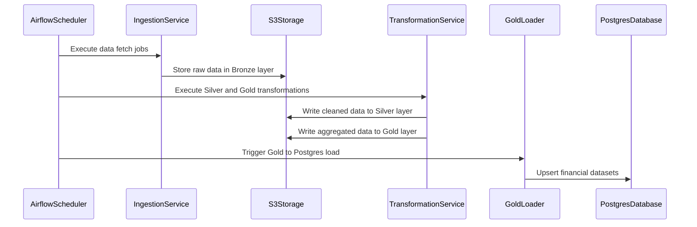
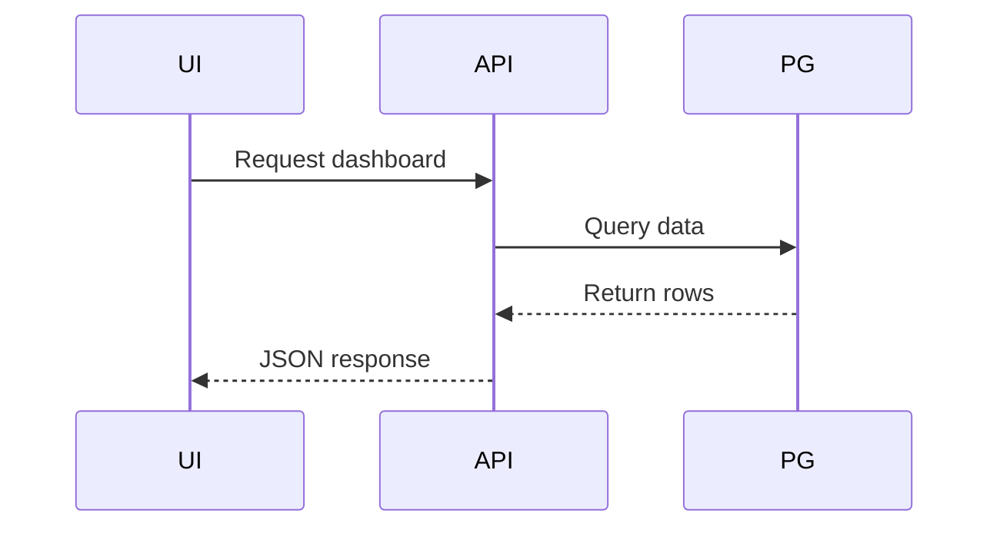

# Finance Data Platform – Architecture Documentation

## 1. Objective

The objective of this project is to build a scalable and cost-efficient financial data platform that:

- Fetches financial data from external providers
- Stores raw data safely
- Cleans and normalizes datasets
- Computes financial metrics
- Serves processed data to a user-facing application
- Maintains strict separation between data engineering and application logic

This architecture follows a batch-based data platform with a serving layer and an application layer.

---

# 2. High-Level Architecture

The system is divided into two major services:

1. Data Platform (Batch Layer)
2. Application Service (User Layer)

## 2.1 System Overview

```mermaid
flowchart TB

subgraph Sources
    YF[Yahoo Finance]
    SEC[SEC EDGAR]
    FX[FX API]
    MAP[OpenFIGI]
end

subgraph Orchestration
    AF[Airflow Scheduler]
end

subgraph DataPlatform
    ING[Ingestion]
    SIL[Silver Transform]
    GLD[Gold Marts]
    LOAD[Load to Postgres]
end

subgraph Storage
    S3B[(S3 Bronze)]
    S3S[(S3 Silver)]
    S3G[(S3 Gold)]
    RDS[(Postgres RDS)]
end

subgraph Application
    API[App API]
    FE[Frontend]
end

AF --> ING
YF --> ING
SEC --> ING
FX --> ING
MAP --> ING

ING --> S3B
S3B --> SIL
SIL --> S3S
S3S --> GLD
GLD --> S3G
S3G --> LOAD
LOAD --> RDS

RDS --> API
API --> FE
````

---

# 3. Layer Responsibilities

## 3.1 Data Platform

The Data Platform is responsible for:

* Fetching external APIs
* Storing raw data
* Cleaning and transforming datasets
* Computing financial metrics
* Loading final datasets into Postgres

This service runs on a scheduled batch process and does not serve end users directly.

---

## 3.2 Application Service

The Application Service is responsible for:

* Authentication
* Portfolio management
* User dashboards
* Financial simulations
* User requests

The application does not call external APIs directly. It reads exclusively from Postgres.

---

# 4. Data Architecture (Bronze, Silver, Gold)

The system follows a medallion architecture.

## 4.1 Bronze Layer

Purpose:

* Store raw API responses
* Preserve original payloads
* Enable reprocessing

Characteristics:

* JSON format
* Append-only
* Partitioned by date
* Stored in S3

Example path:

```
s3://fin-platform-prod/bronze/source=yahoo/dataset=prices/dt=2026-02-17/AAPL.json
```

---

## 4.2 Silver Layer

Purpose:

* Clean data
* Normalize identifiers
* Standardize schemas
* Enforce consistent typing

Characteristics:

* Parquet format
* Structured tables
* Partitioned by date
* Stored in S3

Example tables:

* prices_daily
* financials_quarterly
* fx_rates

---

## 4.3 Gold Layer

Purpose:

* Compute financial metrics
* Prepare serving-ready datasets
* Optimize for application queries

Examples:

* returns_daily
* volatility_30d
* earnings_surprise
* valuation_ratios

Stored in S3 as Parquet and loaded into Postgres.

---

# 5. Daily Batch Process



---

# 6. User Request Flow



The application layer interacts only with Postgres.

---

# 7. AWS Infrastructure

The architecture is intentionally minimal and cost-controlled.

| Service      | Purpose                          |
| ------------ | -------------------------------- |
| S3           | Storage for Bronze, Silver, Gold |
| RDS Postgres | Serving database                 |
| EC2          | Airflow host                     |
| IAM          | Access control and permissions   |

Services intentionally excluded:

* Redshift
* EMR
* Kinesis
* Glue
* Streaming systems

Estimated monthly cost: approximately 20–25 USD.

---

# 8. Serving Layer (Postgres)

Postgres stores the Gold datasets for fast querying.

Example tables:

prices_daily:

* instrument_id
* date
* open
* high
* low
* close
* volume
* adj_close

financials_quarterly:

* company_id
* period_end
* filing_date
* revenue
* net_income
* eps

returns_daily:

* instrument_id
* date
* return_1d
* return_5d
* volatility_30d

Indexes:

* (instrument_id, date)
* (company_id, period_end)

---

# 9. Design Principles

* Clear separation of concerns
* Batch processing over live API calls
* Postgres as serving layer
* S3 as data lake
* Minimal infrastructure
* Cost control
* Scalability
* Reproducibility
* Auditability

---

# 10. Conclusion

This architecture establishes:

* A modern financial data platform
* A structured medallion architecture
* A clean separation between data and application
* A scalable SaaS-ready serving model
* A cost-efficient AWS deployment

The system is designed for reliability, scalability, and long-term extensibility.

