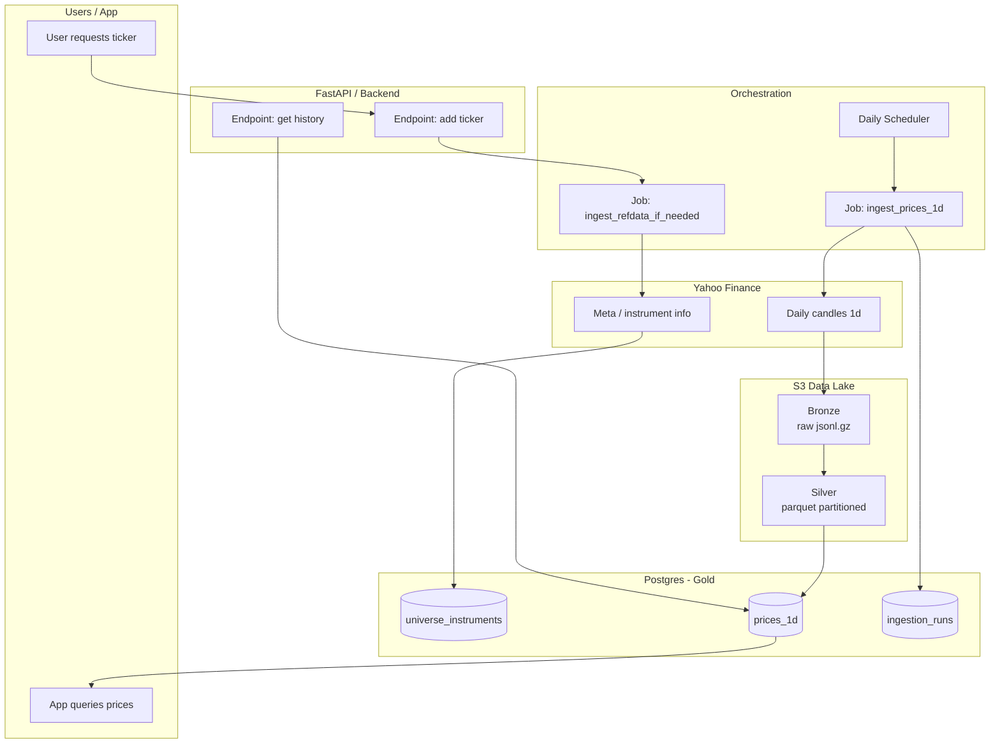
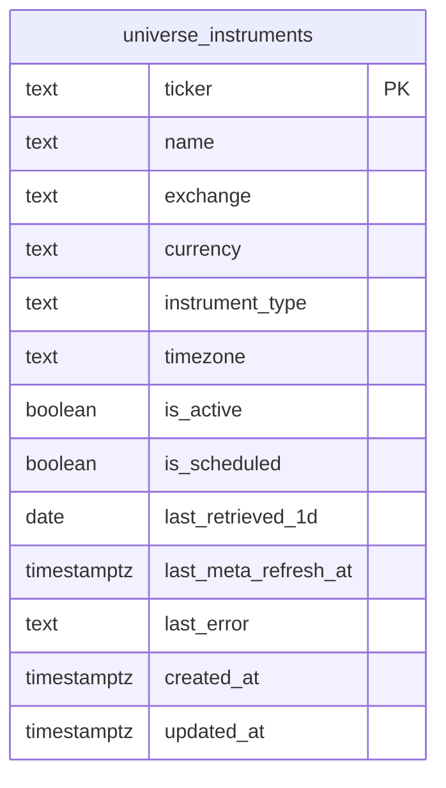
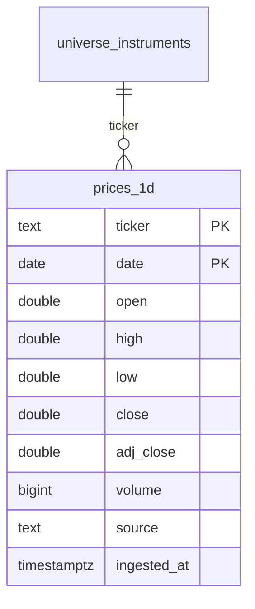
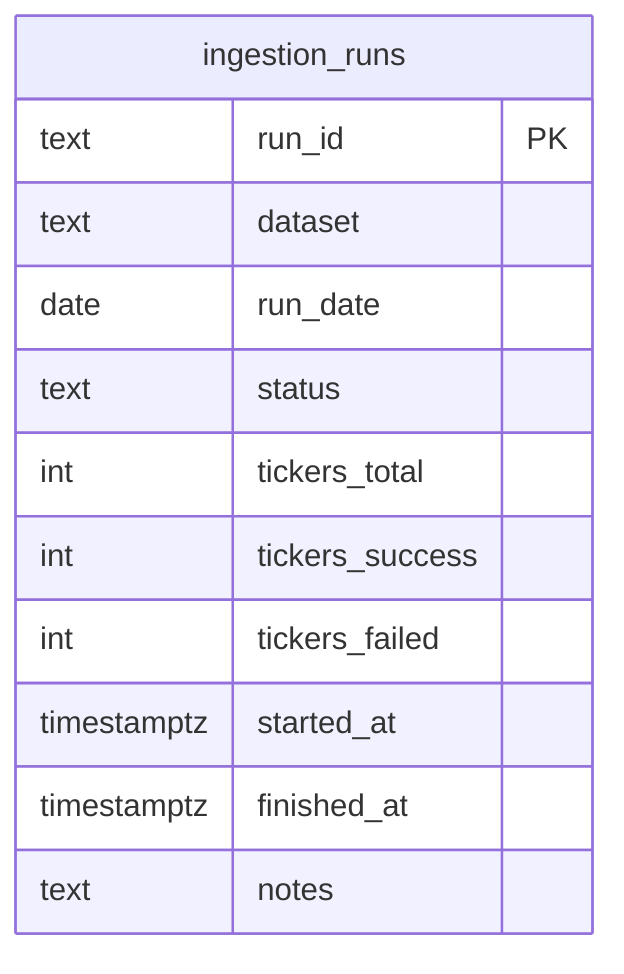
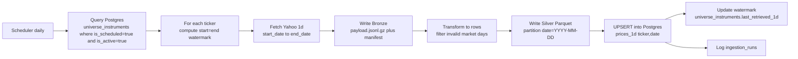
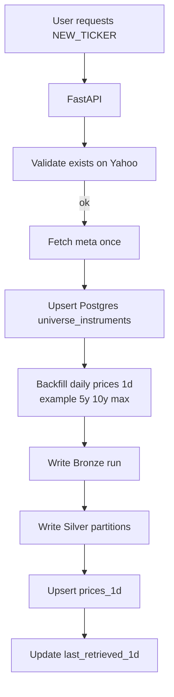

```mermaid
flowchart TB
  subgraph USERS[Users / App]
    U1[User requests ticker]
    U2[App queries prices]
  end

  subgraph API[FastAPI / Backend]
    A1[Endpoint: add ticker]
    A2[Endpoint: get history]
  end

  subgraph ORCH[Orchestration]
    SCHED[Daily Scheduler]
    JOB1[Job: ingest_refdata_if_needed]
    JOB2[Job: ingest_prices_1d]
  end

  subgraph VENDOR[Yahoo Finance]
    YMETA[Meta / instrument info]
    YPRICES[Daily candles 1d]
  end

  subgraph S3[S3 Data Lake]
    BR[Bronze<br/>raw jsonl.gz]
    SV[Silver<br/>parquet partitioned]
  end

  subgraph PG[Postgres - Gold]
    UI[(universe_instruments)]
    P1D[(prices_1d)]
    RUNS[(ingestion_runs)]
  end

  U1 --> A1 --> JOB1
  SCHED --> JOB2

  JOB1 --> YMETA --> UI

  JOB2 --> YPRICES --> BR --> SV --> P1D
  JOB2 --> RUNS
  A2 --> P1D --> U2
```

## 0

```mermaid
erDiagram
  universe_instruments {
    text ticker PK
    text name
    text exchange
    text currency
    text instrument_type
    text timezone
    boolean is_active
    boolean is_scheduled
    date last_retrieved_1d
    timestamptz last_meta_refresh_at
    text last_error
    timestamptz created_at
    timestamptz updated_at
  }
```

## 1 

```mermaid
erDiagram
  prices_1d {
    text ticker PK
    date date PK
    double open
    double high
    double low
    double close
    double adj_close
    bigint volume
    text source
    timestamptz ingested_at
  }

  universe_instruments ||--o{ prices_1d : "ticker"
```

### 2

```mermaid
erDiagram
  ingestion_runs {
    text run_id PK
    text dataset
    date run_date
    text status
    int tickers_total
    int tickers_success
    int tickers_failed
    timestamptz started_at
    timestamptz finished_at
    text notes
  }
```

## 3

```mermaid
flowchart LR
  SCHED[Scheduler daily] --> Q[Query Postgres<br/>universe_instruments where is_scheduled=true and is_active=true]
  Q --> W[For each ticker<br/>compute start=end watermark]
  W --> F[Fetch Yahoo 1d<br/>start_date to end_date]
  F --> B[Write Bronze<br/>payload.jsonl.gz plus manifest]
  B --> T[Transform to rows<br/>filter invalid market days]
  T --> S[Write Silver Parquet<br/>partition date=YYYY-MM-DD]
  S --> G[UPSERT into Postgres<br/>prices_1d ticker,date]
  G --> U[Update watermark<br/>universe_instruments.last_retrieved_1d]
  G --> R[Log ingestion_runs]
```

## 4

```mermaid
flowchart TB
  U[User requests NEW_TICKER] --> API[FastAPI]
  API --> V[Validate exists on Yahoo]
  V -->|ok| M[Fetch meta once]
  M --> UI[Upsert Postgres universe_instruments]
  UI --> BF[Backfill daily prices 1d<br/>example 5y 10y max]
  BF --> BR[Write Bronze run]
  BR --> SV[Write Silver partitions]
  SV --> PG[Upsert prices_1d]
  PG --> WM[Update last_retrieved_1d]
```

