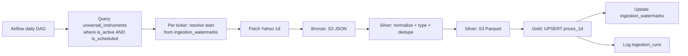
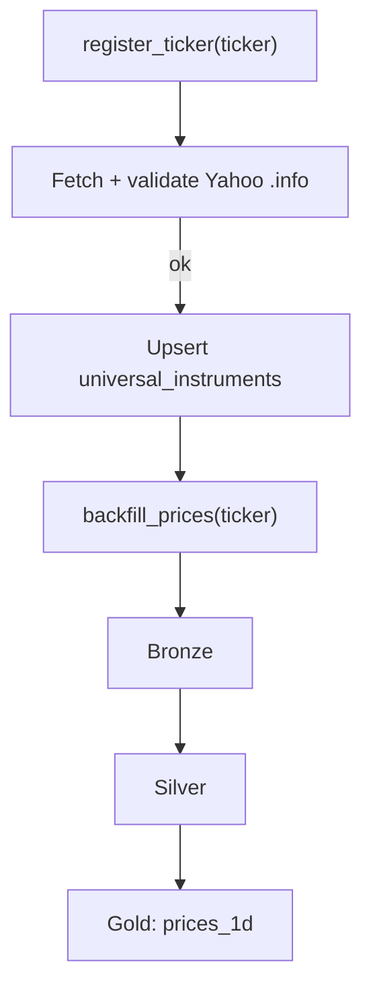
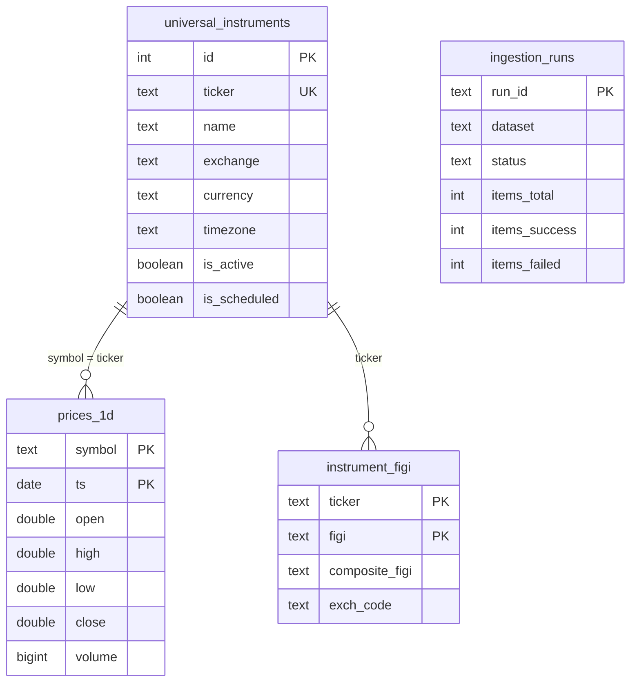

# Data Flow

## Daily scheduled ingestion

Same shape for `run_macro.py` (FRED) and `run_fundamentals.py` (SEC EDGAR),
just swapping the source and the Gold table.

## Registering a new ticker

`is_scheduled=False` registers a ticker without enrolling it in the daily
DAG; `set_scheduled()` flips it later.

## Key tables

